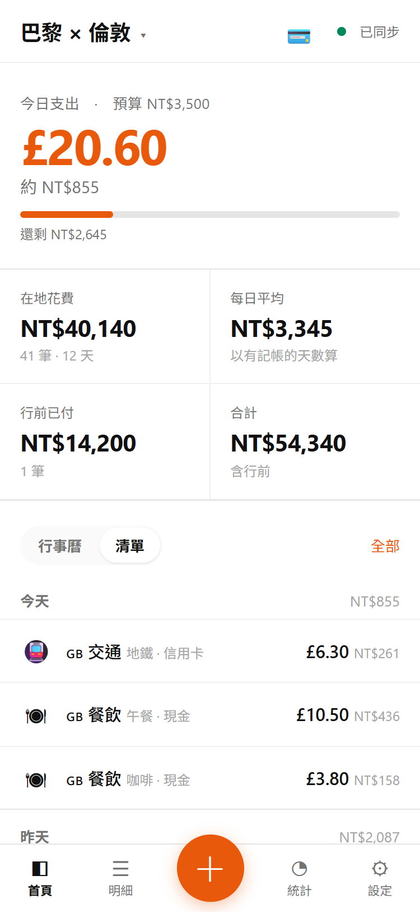
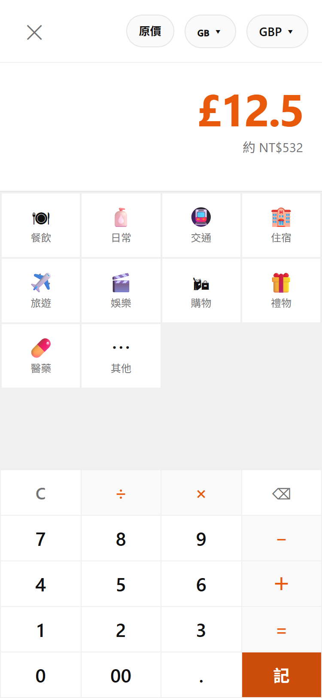
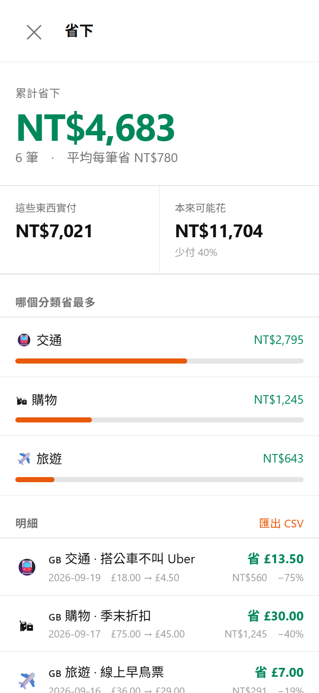
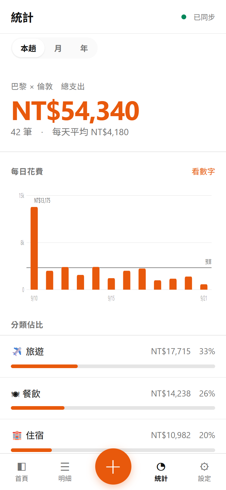
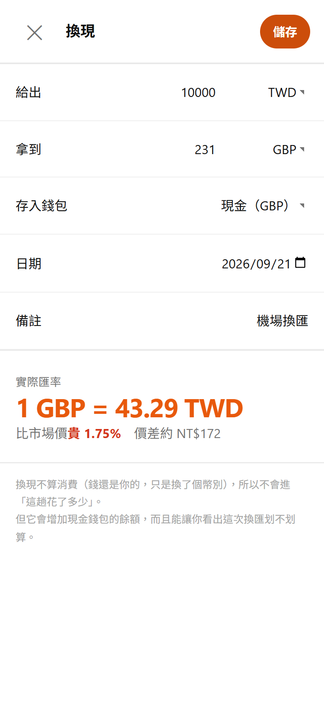

# money-saving-expense-tracker: travel spending, and what I saved

Log what I spend while travelling, and alongside it, what each purchase would have cost. The gap is what I saved.
Log on the phone, review on a laptop; it works fully offline, in any currency.

**Runs on** Cloudflare Workers + D1, with a zero-dependency vanilla JS PWA. Deployed on my own domain for personal use (single user, password-protected), so there is no public demo; the screenshots below use a demo trip, not my real spending.

*The UI is in Chinese because I built it for my own use; key screens are annotated in English below.*

<table>
<tr>
<td width="50%" valign="top"><br>
<sub><b>Home.</b> Today's spending against the daily budget, trip totals, and the latest entries.</sub></td>
<td width="50%" valign="top"><br>
<sub><b>Logging in three steps.</b> Type the amount, tap a category, done. The "原價" (original price) button switches the keypad to what it would have cost.</sub></td>
</tr>
<tr>
<td width="50%" valign="top"><br>
<sub><b>Saved.</b> Running total, which category saves most, and each entry with its discount %. Never subtracted from spending.</sub></td>
<td width="50%" valign="top"><br>
<sub><b>Stats.</b> Daily spending against the budget line, then spending by category.</sub></td>
</tr>
<tr>
<td width="50%" valign="top"><br>
<sub><b>Currency exchange.</b> The rate I actually got vs the market rate, and what the spread cost. Exchanging isn't spending, so it's kept out of the totals.</sub></td>
<td width="50%" valign="top"></td>
</tr>
</table>

---

## Why I built it

I built this for myself. I wanted to know how much I actually save.

- **Expense trackers only record what I paid.** None of them has a place for what I *would* have paid: the member price, the early-bird ticket, the bus instead of the taxi. Those choices add up, but they leave no trace, so I couldn't tell whether my effort to spend carefully was making any difference.
- **Travelling makes it harder.** I spend long stretches moving around the UK and Europe, paying in pounds and euros but thinking in Taiwan dollars. I wanted every figure, spending and savings alike, in one currency I actually feel.
- **Logging has to be instant.** If recording a purchase takes more than a few seconds at the till, or needs a signal on the Underground, I stop doing it and the numbers become fiction.

So every entry can carry two numbers: what I paid, and what it would have cost. It is still a full expense tracker, kept separate from my everyday budget at home; the savings sit alongside it rather than replacing it.

---

## How savings are recorded

```
entry     what I paid          £45.00   Coat
  └ reference_amount  what it would have cost   £75.00
  └ saving_note       how I saved               end-of-season sale
                      saved = 75 − 45 = £30 (40%)
```

**One optional field, not a separate ledger.** A saving only exists because of a purchase, so it lives on the entry itself. If you never touch the "original price" button, logging is exactly as fast as before.

**"How I saved" is kept apart from "what I bought".** The note says *coat*; the saving note says *end-of-season sale*. Mixing them would make it impossible to ask later which habits save the most.

**The Saved page covers every trip, not just the current one.** Savings accumulate over time; a total that resets whenever I switch trips would mean very little.

---

## Three non-negotiable rules

**1. Savings never offset spending.** The £45 coat that was £75 is still £45 spent; the £30 saved doesn't make it cost less. If savings were subtracted from spending, the app would stop showing me what I spend and start helping me justify it. So "saved" is always shown alongside spending and never appears in any net figure. This rule is the reason the app is worth having: I built it *because* I wanted to see my savings, and that is exactly why they must not be allowed to flatter my spending.

**2. The exchange rate is frozen when an entry is logged.** Every entry stores its `rate_to_twd` and `amount_twd` at the moment it was logged. Recalculating with today's rate would turn "how much has this trip cost" into a number that changes every day and never reconciles. Editing the amount keeps the frozen rate; changing the currency looks up the rate for that entry's date.

**3. Exchanging currency is not spending.** Turning TWD into GBP leaves the money mine, just in another currency. The spread lost on the exchange is a real cost, though, so it's calculated and shown separately rather than mixed into spending.

Guard rails around savings: a saving is recorded only when the reference price is higher than what was paid, and an entry with a reference price but no amount paid is rejected.

---

## Logging in three steps

Amount → category → saved, all on one screen with no scrolling. Tapping a category saves immediately; a long press opens the full form (payment method, note, bill split, tax refund).

- **The keypad is a calculator.** 3×8 or 12.5+4.2 works directly, for splitting a bill or adding up a receipt
- **"Paid" and "original price" share the same keypad**, so recording a saving is one extra tap, not a separate form
- **On a laptop, it's all keyboard**: typing a number opens the keypad, arrow keys pick a category, Enter saves, Esc closes
- **The home screen opens by default**, not the keypad. On iPhone, a home-screen shortcut can jump straight to logging instead

---

## Trips, countries and currencies

**Trips** group entries and carry an optional daily budget in TWD; the home screen follows the active trip. **Country tagging** switches the currency with it, and the stats page shows spending by country.

**Pre-trip spending** (flights and hotels paid before leaving) is tracked separately from spending on the ground. Otherwise the first day's average looks absurd.

Rates come from two free sources with no key needed (`@fawazahmed0/currency-api`, falling back to `open.er-api.com`), stored with TWD as the base, refreshed by a cron at 01:30 UTC daily. **Freshness is judged by actual age, not by comparing date strings**: the server records dates in UTC, and the local date in Taipei is often a day ahead, so a string comparison would always say "not today".

---

## Accounts: how much do I have left

The home screen deliberately has only three blocks: today, this trip, recent entries. Cash balances and card limits describe the state of a payment method, not how much the trip cost, so they live on a separate Accounts page, one tap from the home header.

| | |
|---|---|
| 💵 Cash wallets | Balance = cash received from exchanges − cash spent |
| 💳 Cards | Spend this month against a **monthly limit I set myself**, reset on the 1st, separate from the bank's credit limit |
| 🔁 Exchanges | Each exchange records the rate I got and its spread against the market rate |

**Cash balances only count movements in the same currency.** Deducting a euro expense from a sterling wallet would be wrong; it almost always means the wrong wallet was picked while logging. Instead the app shows "N entries in other currencies not counted", so there's a chance to notice.

---

## Bill splitting

Companions are a plain list of names; they don't need to sign up or install anything. Split **by shares** (one each by default = equal) or **by exact amounts**; "who paid" can be me or anyone else, so both "I fronted it" and "I owe them" work.

**My own share is stored as a split row too.** Storing only other people's shares makes the two directions asymmetric and easy to get backwards; storing every participant lets both share the same logic.

**The rounding remainder goes to the payer.** £47.20 split three ways is 15.7333…, so two people pay 15.73 and the payer takes 15.74, adding back to exactly 47.20. Otherwise every split is a penny off, and over time the balances stop reconciling.

Balances are netted automatically (what they owe me minus what I owe them), and "settled" records one offsetting entry rather than deleting anything.

---

## Stats

- **Daily spending bar chart**, hand-written SVG, with a budget reference line, hover tooltips and a table view (a tooltip must never be the only way to read a value)
- **By category, by country, by currency**, for the current trip, a month or a year
- **Tax-refund list**, with entries marked as claimed

**No pie charts.** A pie of 12 categories can't be read: the eye can't compare adjacent slice angles. Sorted bars with the numbers beside them double as a table. Likewise, "pre-trip vs on the ground" is just two numbers, a statistic rather than a chart.

---

## Export and Google Sheets

| Format | Contents |
|---|---|
| CSV | Every entry, UTF-8 **with a BOM** so Excel opens Chinese text correctly |
| Savings CSV | Only entries with a saving, with a running-total column ready to chart |
| XLSX | Six sheets, frozen header rows, thousands separators, auto column widths |
| JSON | Full backup and restore, including deletion markers |

**No SheetJS.** An `.xlsx` file is a zip of a few XML files; writing it in STORED (uncompressed) mode only needs a hand-computed CRC32, about 150 lines. SheetJS is around 400KB compressed, too heavy for a PWA that has to open instantly offline.

**Restore keeps the original timestamps.** The normal save path stamps `updated_at` with the current time, which would make restored data look newer than it is and overwrite real edits on other devices. Importing the same backup twice creates no duplicates.

**Google Sheets sync** ([`google-sheets/`](google-sheets/)): an Apps Script pulls every entry nightly from a read-only endpoint and rebuilds an overview (monthly and yearly spending and savings, with a chart), the full entry list, and a savings sheet. The endpoint uses **its own token, not the login password**: it can only read, so if it leaks the damage is limited, and it can be rotated without signing any device out.

---

## Offline and sync

```
Phone / laptop
   │
   │  The UI only reads and writes IndexedDB; it never waits for the network
   ▼
IndexedDB ──background sync queue──▶ POST /api/sync ──▶ Cloudflare D1
```

- **IndexedDB is the source of truth.** I often log on the Underground or just after landing, before roaming is on. Waiting for the server before updating the screen would make the app useless exactly when it's needed
- **Sync uses a server sequence number, not timestamps.** The server issues a monotonically increasing `server_seq` and each device remembers the last one it saw, so wrong clocks or time zones never affect what gets pulled. `updated_at` only resolves conflicts, which are rare with one user
- **No foreign keys.** During sync, child rows can arrive before their parents, and foreign keys would reject them; integrity is handled in the app
- **Soft deletes.** A deletion leaves a row with `deleted_at` set; otherwise it could never reach other devices
- **Navigation is cache-first.** The hardest case when travelling isn't no connection, it's public Wi-Fi that connects and then crawls. Network-first would leave the app stuck waiting for a timeout
- **Dates are local.** `spent_date` is the local date, so dinner at 11pm in London doesn't count as tomorrow

---

## Development

```bash
npm install
cp .dev.vars.example .dev.vars      # set APP_PASSWORD
npx wrangler d1 execute travel-money --local --file=./schema.sql
npm run dev
```

**If a change under `public/` doesn't show up, suspect the service worker first.** It is cache-first (the price of instant offline launch), so the browser serves the old version and updates in the background. When testing, clearing it is fastest:

```js
for (const r of await navigator.serviceWorker.getRegistrations()) await r.unregister();
for (const k of await caches.keys()) await caches.delete(k);
location.reload();
```

When the list of files under `public/` changes, update the `SHELL` array in `sw.js` and bump `VERSION`.

---

## Deployment

```bash
npx wrangler d1 create travel-money
```

Paste the printed `database_id` into `wrangler.toml`, then:

```bash
npx wrangler d1 execute travel-money --remote --file=./schema.sql
npx wrangler secret put APP_PASSWORD
npx wrangler secret put SESSION_SECRET
npx wrangler deploy
```

Put your own domain in the `routes` entry of `wrangler.toml`; it attaches automatically on deploy. `EXPORT_TOKEN` is only needed for the Google Sheets sync.

In my own setup, pushing to `main` deploys through GitHub Actions ([`.github/workflows/deploy.yml`](.github/workflows/deploy.yml)). That lets me change the app from Claude Code on my phone, which runs in a sandbox with no Cloudflare credentials. In this public copy the workflow is switched off.

Everything fits in Cloudflare's free tier (Workers, D1, cron triggers, custom domains); personal use costs $0 a month.

---

## Files

```
src/index.js          Worker: login, two-way /api/sync, exchange-rate API, daily rate cron, read-only export endpoint
schema.sql            D1 schema (sync tables each have id/updated_at/deleted_at/server_seq)
public/app.js         Screens and interaction (one file, divided by section comments)
public/db.js          IndexedDB + sync queue
public/fx.js          Currency conversion, amount formatting, local dates
public/charts.js      Hand-written SVG daily chart
public/export.js      CSV, xlsx and JSON backup (no dependencies; builds the zip itself)
public/countries.js   Country list
public/app.css        Styles (CSS variables at the top)
public/sw.js          Service worker
google-sheets/        Apps Script for the nightly Google Sheets sync
CLAUDE.md             The standing brief I give AI coding agents: decisions already made and rules not to break
```

---

## Progress

- **Phase 1 and 2** (2026-08-17): login, three-step logging, multiple currencies with frozen rates, offline logging, two-way sync; trips, countries, payment methods, monthly card limits, currency exchange and cash balances, pre-trip spending
- **Deployed** (2026-08-17) for personal use
- **Phase 3 and 4** (2026-08-18): bill splitting and settlement; daily chart, currency and tax-refund views, CSV / XLSX export, JSON backup and restore
- **Calculator keypad, calendar, monthly and yearly stats** (2026-08-24)
- **Category management** (2026-08-27): categories trimmed to the ones I actually use, plus a page to add, rename, reorder and delete them and change their icons
- **Savings** (2026-08-27 to 08-29): reference price on every entry, entered right on the logging keypad; a "how I saved" note; a Saved page with totals, per-category breakdown and discount %; a savings CSV
- **Google Sheets sync** (2026-08-31): read-only export endpoint with its own token, nightly Apps Script with three sheets

### How it was verified

Every change was actually run, not just read through:

- **Offline**: with **the dev server stopped entirely**, an entry was logged and the app still reloaded; the entry was pushed automatically once the server came back
- **Sync**: one entry written from each of two sources; both directions synced, and deletions propagated
- **Frozen rates**: today's rate was changed by hand in the database; old entries' TWD amounts didn't move, and new entries used the new rate
- **Money calculations**: checked against hand-calculated values, not "looks about right"; this caught floating-point noise in exports (7.199999999999999), now rounded per column while the exchange rate deliberately keeps full precision
- **Layout**: no horizontal overflow at 375×812 or 1280×800; separate tap targets are at least 44px
- **Contrast**: white on the tangerine accent measured 3.58, failing WCAG AA, so white text sits on a darker `#CC4D0A` instead
- **Nightly Sheets sync**: confirmed in Cloudflare's request logs, running every night at 22:00 London time with HTTP 200
